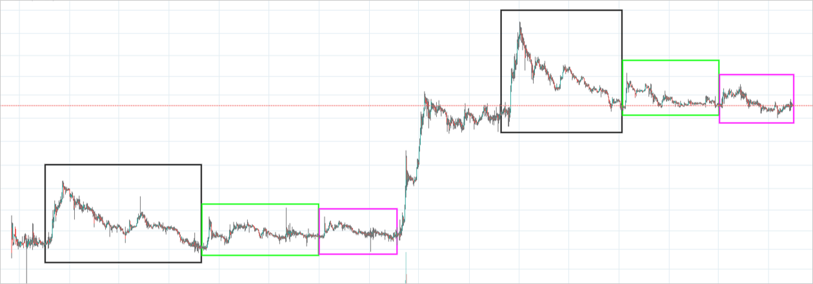
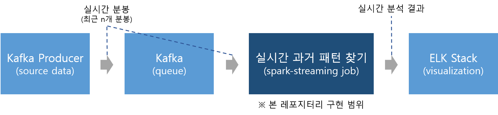
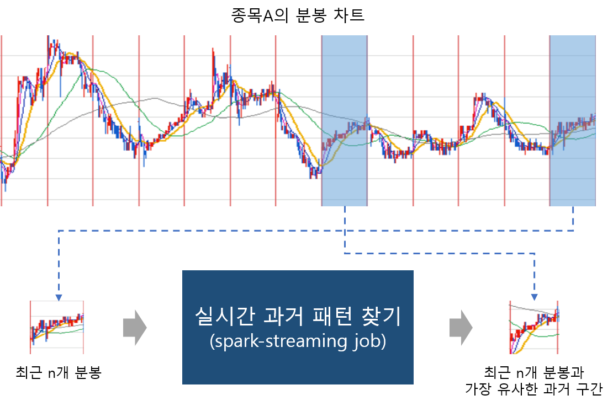

# Stock Pattern Stream

주식 종목의 가격과 거래량을 보고 금융 시장의 흐름을 예측하는 것을 기술적 분석이라 합니다.
종목의 주가 패턴은 때떄로 반복적으로 나타나기도 하며, 주식 거래를 하는 많은 사람들이 주가를 예측하기 위해 이러한 패턴을 분석하곤 합니다.
만약 현재의 주가 차트가 과거의 어떤 시점과 매우 유사하다면, 해당 과거 시점의 추이가 현재 주가의 추이를 예측하는데 도움이 될 수도 있습니다.

<p align="center">
  
</p>

본 레포지터리는 *"종목의 과거 주가 차트에서 현재 차트와 가장 유사한 구간을 실시간으로 찾아주는 프로그램이 있다면 편리하지 않을까?"*
라는 아이디어를 Spark Streaming으로 구현한 것입니다.


## Architecture

### 전체 구성
<p align="center">
  
</p>

- Kafka Producer
  - 키움 OpenAPI 등으로 종목 분봉 데이터를 실시간으로 수집하여 Kafka에 전송해주는 producer 프로세스
  - 분석 대상 종목들의 최근 n개 분봉을 전송
- Kafka
  - 분봉 데이터 저장 Queue
- 실시간 과거 패턴 찾기
  - 본 레포지터리의 구현 범위
  - Spark Streaming Job으로 Kafka의 데이터를 입력 받아 실시간으로 분석
  - 분석 결과를 FS에 저장
- ELK Stack
  - Logstash, Elasticsearch, Kibana를 이용하여 실시간 분석 결과를 시각화
  - Logstash: 저장된 분석 결과를 Elasticsearch에 입력
  - Kibana: 실시간 분석 결과를 대시보드에 시각화

### 실시간 과거 패턴 찾기

본 프로세스에선 종목의 과거 주가 차트에 window sliding을 적용하여 n 크기의 슬라이드들을 생성합니다.

Spark Streaming Job은 종목의 최근 n개 분봉을 입력받으면, 
미리 생성한 슬라이드들과 입력 분봉의 상관관계를 분석하여 최근과 가장 유사한 슬라이드를 찾습니다.

<p align="center">
  
</p>


### 소스 코드

- StockPatternStream.scala
  - 메인 싱글톤. arguments parsing 및 분석 함수 호출
- Preprocessor.scala
  - DataFrame 전처리 수행
- PatternFinder.scala
  - Spark ML을 이용한 Correlation 계산
- StreamingManager.scala
  - Spark Streaming 정의
- CommonUtils.scala
  - 유틸리티 함수 모음

## How to use

### Prerequisite
|name|version|
|:---|:---|
|Scala|2.11.12|
|sbt|1.3.10|
|Java|1.8.0|
|Spark|2.4.5|
|spark-streaming-kafka|0.10.0|

### Usage

create fat jar
```
sbt assembly
```

spark submit
```
spark-submit jarfile --hist-path [path1] --symb2name-path [path2] --output-dir [path3]
        --kafka-bootstrap-server [addr] --kafka-group-id [id] --kafka-topic [topic]

arguments
 --hist-path: 종목별 과거 분봉 데이터 경로
 --symb2name-path: 종목코드->종목명 매핑 테이블 경로
 --output-dir: 분석 결과 저장 경로
 --kafka-bootstrap-server: 카프카 부트스트랩 주소 (localhost:9092)
 --kafka-group-id: 컨슈머 그룹 ID
 --kafka-topic: 토픽명
```


## Future tasks

- Spark Streaming과 Elasticsearch 연동, Logstash 단계 제거
- 싱글모드 -> 클러스터 전환 성능 실험
